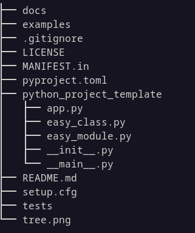

# python_project_template

File presenti in questo TEMPLATE:

* **LICENSE** 
  è il file che contiene la licenza con cui rilascerai il tuo codice. Mi sono
  permesso di metterne una io... se non ti va bene, scegline un'altra qui: <https://choosealicense.com/>
  
* **MANIFEST.in** 
  Questo file serve per creare un pacchetto da eventualmente caricare su pypi.
  Non devi modificarlo! Facile :)
  
* **pyproject.toml** 
  Questo file serve per creare un installer per distribuire il tuo progetto ai 
  comuni mortali. 
  Non devi modificarlo! Facile :)
  
* **README.md** 
  Questo file che stai leggendo adesso! Dovrà contenere una descrizione sommaria del tuo
  progetto (scritta in Markdown... tranquilli, è semplice!). Fallo dopo aver capito
  discretamente bene tutto il resto!

* **tree.png** 
  È solo l'immagine che vedrete fra poco qui sotto. 
  Ignoratela, toglietela o sostituitela quando modificherete il file README.md
  
* **setup.cfg** 
  Questo file serve per creare un installer per distribuire il tuo progetto ai 
  comuni mortali. Purtroppo questo file andrà modificato! Ci penserai con calma...
  in particolare dovrai cambiare il nome del progetto e le dipendenze da installare
  per farlo funzionare (guarda gli import *esterni* nel codice che scrivi)
 
* **docs** (cartella) 
  Questa cartella conterrà la documentazione del tuo progetto... non farmi ridere dai...
  cancellala e passiamo ad altro!
  
* **examples** (cartella) 
  Questa cartella conterrà alcuni piccoli esempi di codice con cui utilizzare il tuo modulo.
  Sarà utile se sviluppi una libreria (ad esempio, un modulo che modifica i file MP3). Se
  scrivi un programma (ad esempio, un gioco, un blocco note, etc...), serve a poco.
  
* **tests** (cartella) 
  Questa cartella conterrà i tests del tuo modulo. Quello dei test è un argomento importante
  e un pochino complicato... approfondiamo se serve. Per adesso puoi cancellare questa cartella
  
* **python_project_template** (cartella) 
  La cartella con il nome del modulo. Va rinominata con lo stesso nome del tuo progetto. Se
  ad esempio fai un progetto che si chiama "briscola", rinominerai la cartella in "briscola".
  Dentro ci sono vari file che devi studiare un pò e sistemare in base al nuovo nome del 
  modulo!

  * **app.py** 
    Questo file deve contenere solo una funzione run() che "esegue" il programma iniziale.
    
  * **__init__.py** 
    Questo file va lasciato vuoto a meno che non creiate dei sottomoduli :D
    
  * **__main__.py** 
    Questo file va modificato solo per sistemare il nome del progetto. Viene eseguito automaticamente
    quando nella cartella principale si esegue il codice: `python -m python_project_template`
    
  * **easy_module.py** 
    Un modulo di esempio, in caso non vogliate programmare secondo la OOP
  
  * **easy_class.py** 
    Una classe di esempio, per programmare secondo la OOP
    

Alla fine quindi, la struttura della cartella del progetto sarà tipo questa:

----------------------------------------------------------------------------------------------------------

## File aggiuntivi

* il file **.gitignore** è una caratteristica di git. Permette di indicare alcuni tipi di file o cartelle, tipicamente prodotti durante l'esecuzione del codice, che vanno ignorati
  da git, in modo da non caricare nel repository file inutili e/o autogenerati.
  Quello che ho inserito io contiene tutte le cose da ignorare tipiche dei progetti Python. In teoria non dovete toccarlo: va lasciato così come è.

* il file **requirements.txt** serve per preparare un ambiente di test per il programma che state sviluppando. *Adesso non c'è*. Dobbiamo parlare di ambienti virtuali e altro prima
  di poterlo inserire. Quando lo avremo fatto... sarà banale inserirlo anche da soli se ne avrete bisogno!
  

Buon lavoro!

